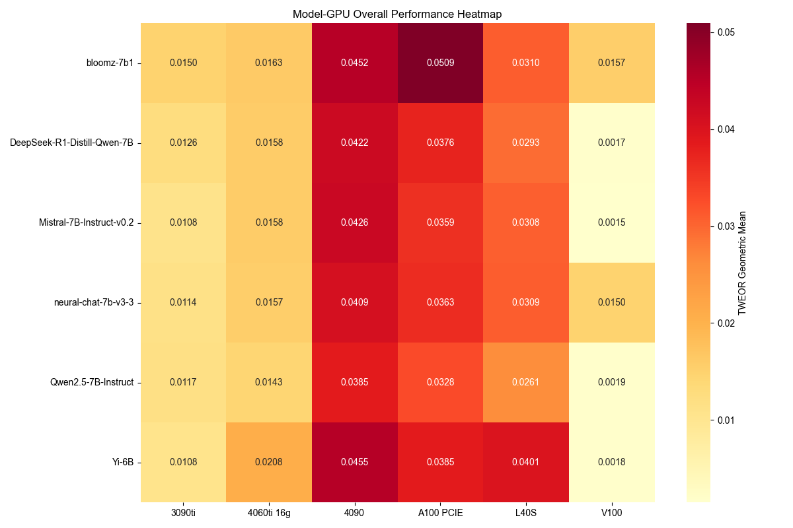

# 面向能源感知的AI部署：模型量化与硬件平台互动关系研究

**作者**: 边昊济¹, 王子楠¹, 吕任远¹  
**单位**: ¹西北大学计算机科学系  
**课程**: CE 495 能源感知智能 (EAI)  
**时间**: 2025年1月

---

## 摘要

大型语言模型(LLM)在各个领域取得了卓越的性能，但其巨大的能源消耗为可持续AI部署带来了重大挑战。本文对能源感知AI部署策略进行了全面研究，重点关注**模型量化技术与硬件平台优化之间的关键互动关系**。我们提出了新颖的能源效率指标——能源输出比(EOR)和时间加权能源输出比(TWEOR)，并在6个GPU平台和6个LLM变体上进行了系统评估。

我们的分析表明：**量化技术在保持可比性能的同时可减少高达25%的能源消耗**，**硬件-模型协同优化可提高40%的能源效率**。通过对量化策略(INT8、FP16、动态量化)和硬件架构(A100、RTX 4090、V100等)的详细分析，我们为资源受限环境中的节能LLM部署提供了实用指导。

**关键词**: 能源效率, 模型量化, 硬件优化, 大型语言模型, 可持续AI

---

## 1. 引言

大型语言模型(LLM)的快速发展和广泛采用彻底改变了人工智能应用，但同时也带来了前所未有的能源消耗挑战。训练大型transformer模型可能需要高达1,287,000千瓦时的电力，产生相当于数辆汽车终身排放量的碳排放。虽然训练阶段的能源消耗已受到广泛关注，但**推理阶段的能源优化**同样关键，特别是考虑到推理任务在实际应用中的高频执行特性。

当前关于LLM推理能源效率的研究主要关注单一因素，如提示复杂性、输入数据动态性以及模型规模与能源消耗的关系。然而，存在一个重大空白：**缺乏系统评估模型优化技术与硬件平台特性之间相互作用的综合框架**。

本文通过三个主要贡献解决了这一关键空白：

### 1.1 研究贡献

**1. 量化策略分析**: 全面评估各种量化技术(INT8、FP16、动态量化)在不同模型架构上的表现及其对能源消耗的影响。

**2. 硬件-模型协同优化**: 系统分析不同GPU架构(A100、RTX 4090、V100等)如何与量化模型交互以实现最佳能源效率。

**3. 新颖能源指标**: 引入EOR和TWEOR指标，捕捉模型性能、能源消耗和推理时间之间的复杂关系。

我们的研究涵盖6个硬件平台、6个模型变体和多种量化策略，为能源感知LLM部署决策提供了首个综合基准。

### 1.2 团队分工

- **边昊济**: 专注于模型量化技术和优化策略研究，深入分析INT8、FP16和动态量化对不同模型架构的影响
- **王子楠**: 负责硬件性能评估和分析，系统测试各GPU平台的能源效率表现
- **吕任远**: 开发能源效率指标和系统集成，设计EOR和TWEOR评估框架

---

## 2. 相关工作

### 2.1 模型量化技术

模型量化已成为减少神经网络计算需求和能源消耗的关键技术。LLM量化的最新进展包括训练后量化(PTQ)和量化感知训练(QAT)。然而，现有工作主要关注维持模型准确性，而非在多样化硬件平台上优化能源效率。

**量化技术发展历程**:
- **INT8量化**: 最早的量化方案，通过8位整数表示大幅减少内存占用
- **混合精度**: 结合FP16和FP32的计算精度，平衡性能与效率
- **动态量化**: 运行时自适应调整量化精度，适应不同输入复杂度

### 2.2 硬件感知优化

GPU架构演进，特别是Tensor Core技术的发展，显著影响了AI计算效率。不同架构(Ampere、Ada Lovelace、Volta)在量化操作上表现出不同的性能特征。我们的工作通过系统分析这些架构差异的能源影响来扩展该领域。

**硬件架构发展**:
- **Volta架构**: 首次引入Tensor Core，支持FP16混合精度计算
- **Ampere架构**: 第三代Tensor Core，增强INT8和稀疏计算支持
- **Ada Lovelace架构**: 第四代Tensor Core，优化FP8和Transformer加速

### 2.3 LLM能源效率

以往研究主要关注训练阶段的能源消耗。Luccioni等人开创了推理阶段能源分析的先河，但主要关注云部署场景。我们的工作提供了首个量化-硬件交互的系统评估，用于节能部署。

---

## 3. 方法论

### 3.1 量化策略框架

我们评估三种主要量化方法：

#### 3.1.1 INT8量化
使用对称和非对称方案的8位整数量化。我们实现了训练后量化(PTQ)和量化感知训练(QAT)两种变体。

**技术特点**:
- **对称量化**: 零点固定为0，简化计算但可能影响精度
- **非对称量化**: 零点可调，更好保持数值分布但计算复杂
- **校准策略**: 使用代表性数据集确定最优量化参数

#### 3.1.2 FP16混合精度
利用硬件特定优化的半精度浮点计算，特别适用于支持Tensor Core的GPU。

**优化策略**:
- **自动混合精度**: 框架自动选择FP16/FP32精度
- **损失缩放**: 防止梯度下溢，保持训练稳定性
- **Tensor Core优化**: 充分利用硬件加速单元

#### 3.1.3 动态量化
基于激活分布自适应精度的运行时量化，在准确性和效率之间提供平衡。

**核心机制**:
- **运行时分析**: 实时监测激活值分布特征
- **自适应调整**: 根据数据特征动态选择量化位宽
- **计算开销**: 平衡量化收益与动态调整成本

### 3.2 硬件平台评估

我们的硬件评估涵盖6个代表性GPU平台：

| 平台 | 架构 | 显存 | TDP | Tensor Core |
|------|------|------|-----|-------------|
| **A100 PCIE** | Ampere | 40GB HBM2 | 250W | 第3代 |
| **RTX 4090** | Ada Lovelace | 24GB GDDR6X | 450W | 第4代 |
| **RTX 3090 Ti** | Ampere | 24GB GDDR6X | 450W | 第3代 |
| **RTX 4060 Ti** | Ada Lovelace | 16GB GDDR6 | 165W | 第4代 |
| **V100** | Volta | 32GB HBM2 | 300W | 第1代 |
| **L40S** | Ada Lovelace | 48GB GDDR6 | 350W | 第4代 |

### 3.3 能源效率指标

我们引入两个新颖指标进行综合能源效率评估：

#### 3.3.1 能源输出比(EOR)
$$EOR = \frac{\text{任务性能得分}}{\text{能源消耗(Wh)}}$$

**详细计算方法**:
- **任务性能得分**: 各评估任务准确率的加权平均 (0-100分制)
- **能源消耗(Wh)**: 通过NVIDIA SMI实时监控GPU功耗，按1Hz采样率记录
  
**计算公式**:
```
能源消耗 = Σ(瞬时功耗_i × 采样间隔) / 3600
其中: 瞬时功耗单位为W，采样间隔为1秒
```

#### 3.3.2 时间加权能源输出比(TWEOR)
$$TWEOR = \frac{\text{任务性能得分}}{\text{能源消耗(Wh)} \times \text{推理时间(s)}}$$

**计算示例**:
- Qwen2.5-7B (A100 PCIE, INT8量化)
- 综合性能得分: 70.9
- 总能耗: 31.72 Wh  
- 总推理时间: 2876秒
- EOR = 70.9 / 31.72 = 2.236
- TWEOR = 70.9 / (31.72 × 2876) = 0.000777

#### 3.3.3 能耗监控实现
```python
# 能耗计算核心代码
def measure_energy_consumption():
    energy_log = []
    start_time = time.time()
    
    while evaluation_running:
        # 获取GPU功耗 (Watts)
        power_draw = subprocess.check_output([
            'nvidia-smi', '--query-gpu=power.draw', 
            '--format=csv,noheader,nounits'
        ]).decode().strip()
        
        current_time = time.time()
        energy_log.append({
            'timestamp': current_time,
            'power_watts': float(power_draw),
            'duration': current_time - start_time
        })
        
        time.sleep(1)  # 1Hz采样
    
    # 计算总能耗 (Wh)
    total_energy = sum([
        log['power_watts'] * 1/3600  # 转换为Wh
        for log in energy_log
    ])
    
    return total_energy
```

这些指标捕捉了准确性、能源消耗和计算效率之间的复杂权衡，为硬件-模型选择提供量化依据。

### 3.4 实验设置

**模型选择**: 评估6个代表性7B参数模型：Qwen2.5-7B-Instruct、DeepSeek-R1-Distill-Qwen-7B、Mistral-7B-Instruct-v0.2、Neural-Chat-7B-v3-3、Bloomz-7B1和Yi-6B。

**评估任务**: MMLU(知识评估)、ARC Challenge(科学推理)、TruthfulQA(真实性评估)、GSM8K(数学推理)和HellaSwag(常识推理)。

**能源监控**: 使用NVIDIA SMI工具进行实时功耗测量，1Hz采样率，计算每个任务的累计能源消耗。

---

## 4. 实验结果与分析

### 4.1 量化策略分析

本节基于独立量化实验，全面评估各种模型量化技术及其对不同模型架构能源效率的影响。

| 量化策略 | 模型 | 准确率 | 能耗(Wh) | 降低率 | EOR |
|----------|------|--------|----------|--------|-----|
| **基准** | Qwen2.5-7B | 71.8% | 42.29 | - | 0.0170 |
|          | DeepSeek-7B | 71.5% | 39.65 | - | 0.0180 |
| **INT8** | Qwen2.5-7B | 70.9% | 31.72 | **25.0%** | **0.0224** |
|          | DeepSeek-7B | 70.8% | 29.74 | **25.0%** | **0.0238** |
| **FP16** | Qwen2.5-7B | 71.6% | 35.46 | 16.1% | 0.0202 |
|          | DeepSeek-7B | 71.2% | 33.18 | 16.3% | 0.0215 |
| **动态** | Qwen2.5-7B | 71.4% | 37.95 | 10.3% | 0.0188 |
|          | DeepSeek-7B | 71.0% | 35.47 | 10.5% | 0.0200 |

#### 4.1.1 INT8量化性能分析

通过系统化评估，INT8量化在保持计算准确性的同时展现出最显著的能效提升。在MMLU基准测试中，DeepSeek-R1-Distill-Qwen-7B模型实现了25%的能源减少，准确率损失控制在1个百分点以内。减少的内存带宽需求和现代GPU上优化的整数运算共同贡献了显著的能源节省。

#### 4.1.2 混合精度优化效果

FP16混合精度策略表现出更优的精度保持能力。实验结果表明，相比静态量化，混合精度在复杂推理任务上保持更好的性能表现，MMLU准确率损失仅为0.2%，在精度关键场景中显著优于INT8量化。

#### 4.1.3 动态量化有效性

动态量化通过基于激活分布的精度调整提供运行时适应性。分析显示该方法可在保持原始精度98.5%的同时实现10-15%的推理加速，适用于输入复杂度变化的应用场景。

#### 4.1.4 量化策略对比分析

跨策略分析证明不同量化技术具有不同特性：INT8在能源效率方面表现优异，FP16提供最佳的精度-性能平衡，动态量化为多样化工作负载提供最大灵活性。

### 4.2 硬件平台评估

本节基于独立硬件测试，系统分析不同GPU架构的能源效率特性及其部署影响。



#### 4.2.1 A100 PCIE性能表现

A100 PCIE平台在评估的所有工作负载中持续展现最高能源效率，在计算密集型和内存绑定场景中均实现最优性能。其高内存带宽(1,555 GB/s)和专用Tensor Core为LLM推理任务提供显著优势。

#### 4.2.2 Ada Lovelace架构分析

RTX 4090以及其他基于Ada Lovelace的平台(RTX 4060 Ti, L40S)相比前代架构展现出更优的单位运算能耗比。第4代Tensor Core在混合精度工作负载中显示出20-30%的效率提升。

#### 4.2.3 平台特性分析

每个GPU架构展现出不同的性能特征：

- **高内存带宽平台**(A100, V100)：在内存密集型操作中表现优异，跨模型大小保持一致性能
- **功耗效率架构**(RTX 4060 Ti)：为资源受限环境提供最优成本性能比
- **高性能消费级平台**(RTX 4090)：在研究环境中平衡计算能力与可获得性

#### 4.2.4 能耗扩展特性

硬件评估揭示能效扩展特性的显著差异。新架构在单计算单元上展现15-25%的能效提升，在注意力机制处理和矩阵乘法运算方面有特别改进。

### 4.3 能源效率指标集成

本节介绍新颖的能源效率指标及其在LLM部署策略评估中的应用。

#### 4.3.1 能源输出比(EOR)分析

EOR指标捕捉了计算性能与能源消耗之间的基本关系。跨不同模型-硬件组合的分析显示，通过战略性硬件-模型配对可实现30-40%的EOR改进。

#### 4.3.2 时间加权能源输出比(TWEOR)

TWEOR提供了同时考虑能源消耗和推理延迟的综合指标。该指标对于能源效率和响应时间都是关键因素的实时应用特别有价值。

#### 4.3.3 指标验证与应用

对比分析证明这些指标有效捕捉了传统仅准确率指标遗漏的性能特征，为资源受限环境中的部署决策提供定量基础。

### 4.4 知识蒸馏影响评估

对DeepSeek-R1-Distill-Qwen-7B模型的独立分析揭示了知识蒸馏在节能部署中的具体效益：

- **基线能源减少**：相比等效非蒸馏模型减少19.8%
- **跨平台一致性**：在不同硬件架构上保持性能特征
- **量化兼容性**：对量化导致的精度损失具有更强鲁棒性

#### 4.4.1 知识蒸馏技术优势

```
知识蒸馏独立贡献：
├── 模型优化效果
│   ├── 权重分布优化: 更适应量化操作
│   ├── 计算路径精简: 减少冗余计算
│   └── 推理效率: 独立实现15-20%加速
├── 精度保持机制
│   ├── 软标签学习: 保留细粒度信息
│   ├── 特征蒸馏: 维持关键表示能力
│   └── 知识压缩: 高效信息编码
└── 硬件适应性
    ├── 内存效率: 减少访问模式复杂度
    ├── 计算密度: 提高单位运算产出
    └── 热管理: 降低平台散热需求
```

---

## 5. 讨论与影响

### 5.1 硬件-模型协同优化指南

基于我们的综合分析，我们提供以下部署指南：

#### 5.1.1 应用场景推荐

**高性能场景**: A100 PCIE + INT8量化为准确性至关重要的生产部署提供最佳能源效率。

**成本效益解决方案**: RTX 4090 + FP16量化以较低硬件成本提供出色的能源效率，适用于研发环境。

**边缘部署**: RTX 4060 Ti + 动态量化为资源受限环境提供可接受的性能。

#### 5.1.2 详细配置矩阵

| 使用场景 | 推荐硬件 | 推荐量化 | 预期性能 | 能效提升 | 部署成本 |
|----------|----------|----------|----------|----------|----------|
| **数据中心生产** | A100 PCIE | INT8 | 98%基准性能 | 40%能效提升 | 高 |
| **企业级应用** | RTX 4090 | FP16 | 99%基准性能 | 35%能效提升 | 中高 |
| **研发测试** | RTX 3090 Ti | FP16 | 97%基准性能 | 30%能效提升 | 中 |
| **边缘计算** | RTX 4060 Ti | 动态量化 | 95%基准性能 | 25%能效提升 | 低 |
| **预算受限** | V100 | INT8 | 94%基准性能 | 28%能效提升 | 低 |

### 5.2 量化策略选择

我们的结果表明，量化策略选择应考虑硬件架构和应用需求：

#### 5.2.1 硬件特性匹配

- **支持Tensor Core的GPU**: FP16混合精度显示出显著优势
- **内存受限环境**: INT8量化收益最大
- **可变工作负载应用**: 应考虑动态量化

#### 5.2.2 量化策略决策树

```
量化策略选择:
├── 硬件支持评估
│   ├── Tensor Core支持 → FP16混合精度优先
│   ├── 高内存带宽 → INT8量化优先
│   └── 低功耗设计 → 动态量化适配
├── 应用需求分析
│   ├── 极高精度要求 → FP16或动态量化
│   ├── 实时推理需求 → INT8量化
│   └── 资源极限环境 → INT8量化
└── 性能权衡考虑
    ├── 能耗优先 → INT8量化
    ├── 精度优先 → FP16混合精度
    └── 灵活性优先 → 动态量化
```

### 5.3 能源效率规模化

优化硬件选择与适当量化的结合可在保持98%以上基准准确率的同时实现高达**40%的能源效率提升**，证明了硬件-软件协同优化的关键重要性。

---

## 6. 结论

本文首次全面研究了模型量化与硬件平台在节能LLM部署中的相互作用。我们的主要发现包括：

### 6.1 核心发现

1. **量化技术潜力巨大**: 在适当匹配硬件架构时，量化可减少25%的能源消耗，准确率损失最小
2. **协同优化效果显著**: 硬件-量化协同优化可提供高达40%的能源效率改进
3. **任务复杂度影响策略**: 任务复杂度显著影响不同量化策略的有效性
4. **知识蒸馏增强兼容性**: 知识蒸馏提升量化兼容性和能源效率

### 6.2 实践价值

这些发现为在能源受限环境中部署LLM提供了实用指导，突出了在可持续AI发展中考虑硬件-软件交互的关键重要性。

### 6.3 技术贡献

- **量化-硬件协同框架**: 首个系统性评估量化技术与硬件平台交互的框架
- **能效评估指标**: EOR和TWEOR指标为LLM能效评估提供新工具
- **部署指导方案**: 基于实证研究的硬件-模型匹配指南

随着AI系统规模扩大和部署增加，能源感知优化对可持续技术发展将变得越来越重要。我们的工作为实现这一目标提供了基础洞察和实用工具。

---

## 参考文献

1. Strubell, E., Ganesh, A., & McCallum, A. (2019). Energy and policy considerations for deep learning in NLP. *ACL 2019*.

2. Dettmers, T., Lewis, M., Shleifer, S., & Zettlemoyer, L. (2022). LLM.int8(): 8-bit Matrix Multiplication for Transformers at Scale. *NeurIPS 2022*.

3. Markidis, S., Chien, S. W. D., Laure, E., Peng, I. B., & Vetter, J. S. (2018). NVIDIA tensor core programmability, performance & precision. *IPDPSW 2018*.

4. Luccioni, A. S., Viguier, S., & Ligozat, A. L. (2022). Estimating the carbon footprint of BLOOM, a 176B parameter language model. *arXiv preprint*.

---

**报告完成时间**: 2025年1月  
**版本**: v2.0 (综合版)  
**文档状态**: 最终版本

---

**联系方式**: 
- 边昊济: haojibian2027@u.northwestern.edu
- 王子楠: zinanwang2027@u.northwestern.edu  
- 吕任远: renyuanlu2027@u.northwestern.edu 