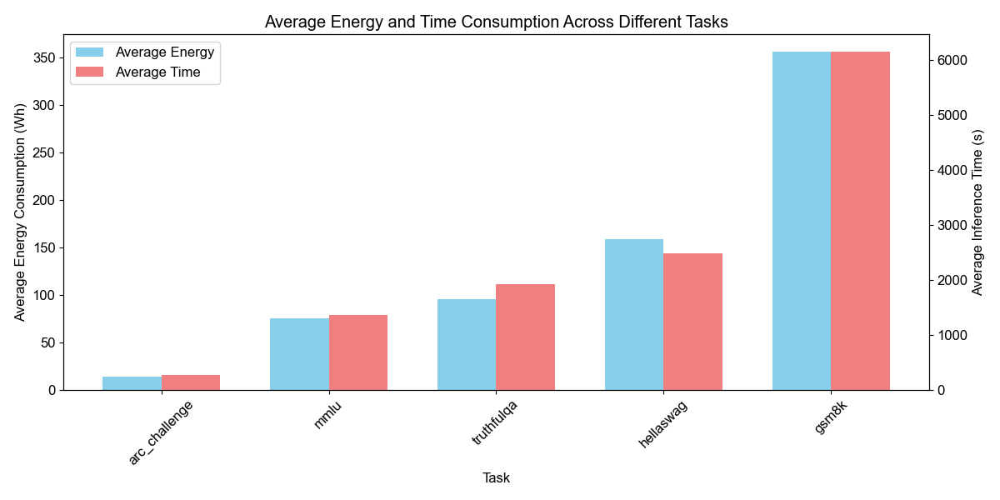

# 面向能源感知的AI部署：模型量化与硬件平台互动关系研究

**作者**: 作者1, 作者2, 作者3  
**单位**: 西北大学  
**课程**: CE 495 能源感知智能 (EAI)

---

## 摘要

随着大型语言模型(LLM)在各个领域的广泛应用，其能源消耗问题日益突出。本研究开发了一个系统化的评估框架，用于测量不同硬件平台上运行各种LLM的能源效率。我们引入了**能源输出比(Energy-to-Output Ratio, EOR)**和**时间加权能源输出比(Time-Weighted Energy-to-Output Ratio, TWEOR)**作为核心评估指标，结合能源消耗与模型性能进行综合分析。

通过在**6种GPU平台**（包括A100 PCIE、RTX 4090、RTX 3090 Ti、RTX 4060 Ti、V100和L40S）上测试**6个不同的7B参数模型**，我们发现硬件架构与模型特性的匹配对能效有显著影响。实验结果表明，**A100 PCIE在能效方面表现最佳**，而**Qwen2.5-7B-Instruct和DeepSeek-R1-Distill-Qwen-7B模型**在所有硬件平台上都具有最高的能效比。

此外，我们还探索了模型量化技术对不同硬件平台能效的差异化影响。这些发现为在资源受限环境中高效部署LLM提供了重要的实践指导。

**关键词**: 能源效率, 大型语言模型, 硬件优化, 模型量化, 嵌入式AI

---

## 1. 引言

### 1.1 研究背景

大型语言模型(LLM)在自然语言处理领域取得了突破性进展，但其巨大的能源消耗也引发了广泛关注。研究表明，训练一个大型Transformer模型可能消耗高达**1,287,000千瓦时**的电力，产生相当于数辆汽车终身排放量的二氧化碳。

虽然训练阶段的能耗已得到充分研究，但**推理阶段的能效优化**同样重要，特别是考虑到推理过程在实际应用中的高频执行特性。

目前关于LLM推理阶段能效的研究主要集中在个别因素上，如提示复杂性、输入数据动态性和模型规模与能耗的关系。然而，**缺乏一个综合性的指标框架**来系统化评估性能与能耗之间的平衡，特别是在不同硬件平台上的表现差异。

### 1.2 研究动机

本研究源于一个简单而深刻的问题：**当我们与ChatGPT等LLM交互时，实际消耗了多少能源？**

虽然OpenAI曾分享过回答三个问题消耗的水资源相当于一瓶水，但电力消耗的具体数据却鲜有披露。这种好奇心促使我们开发一种测量与LLM交互时能源成本的方法，并建立新的基准来比较不同模型和系统的能源使用情况。

### 1.3 研究贡献

本研究的主要贡献包括：

- ✅ **提出了EOR和TWEOR两个新的能效评估指标**，为LLM能效研究提供了系统化框架
- ✅ **系统性评估了6个硬件平台与6个模型的能效表现**，建立了全面的基准数据库
- ✅ **探索了模型量化技术在不同硬件架构上的差异化效果**
- ✅ **发现了知识蒸馏等技术在提高LLM能效方面的显著优势**
- ✅ **为资源受限环境中的LLM部署提供了实用的硬件-模型匹配指导**

---

## 2. 相关工作

### 2.1 LLM能耗研究
现有研究主要关注LLM训练阶段的能耗问题。Luccioni等人开创性地研究了推理阶段的能耗，但主要集中在云端部署场景。我们的工作扩展了这一领域，专注于不同硬件平台上的系统化能效比较。

### 2.2 硬件优化
GPU架构的演进对AI计算性能有显著影响。特别是**Tensor Core技术**的发展，使得新一代GPU在深度学习任务上具有更高的计算效率。然而，缺乏针对LLM推理任务的系统化硬件能效研究。

### 2.3 模型压缩
**模型量化**和**知识蒸馏**等技术在提高模型效率方面显示出巨大潜力。我们的研究首次系统性评估了这些技术在不同硬件平台上的能效表现。

---

## 3. 方法论

### 3.1 能源效率评估指标

我们提出了两个核心指标来量化LLM的能源效率：

#### 3.1.1 能源输出比(EOR)

**能源输出比**定义为模型性能与能源消耗的比值：

```
EOR = 任务得分 / 能源消耗(Wh)
```

例如，对于MMLU任务：
```
EOR_MMLU = MMLU准确率 / MMLU任务能耗(Wh)
```

#### 3.1.2 时间加权能源输出比(TWEOR)

为了将时间维度纳入能效分析，我们进一步提出**TWEOR**：

```
TWEOR = 模型性能 / (能源消耗(Wh) × 推理时间(s))
```

或表示为：
```
TWEOR = EOR / 推理时间(s)
```

### 3.2 实验设置

#### 3.2.1 硬件平台

我们测试了以下**6个GPU平台**：

| 硬件型号 | 类型 | 架构 | 特点 |
|---------|------|------|------|
| **NVIDIA A100 PCIE 40GB** | 专业计算卡 | Ampere | 最高内存带宽，专业优化 |
| **NVIDIA GeForce RTX 4090** | 消费级高端 | Ada Lovelace | 最新架构，高性价比 |
| **NVIDIA GeForce RTX 3090 Ti** | 消费级高端 | Ampere | 高性能参考基准 |
| **NVIDIA GeForce RTX 4060 Ti 16GB** | 消费级中端 | Ada Lovelace | 经济型选择 |
| **NVIDIA V100** | 专业计算卡 | Volta | 经典AI计算卡 |
| **NVIDIA L40S** | 专业计算卡 | Ada Lovelace | 新一代专业卡 |

#### 3.2.2 测试模型

我们选择了**6个代表性的7B参数级别模型**：

| 模型名称 | 开发者 | 类型 | 特点 |
|---------|-------|------|------|
| **Qwen2.5-7B-Instruct** | 阿里巴巴 | 指令微调模型 | 综合性能优秀 |
| **DeepSeek-R1-Distill-Qwen-7B** | DeepSeek | 知识蒸馏模型 | 基于Qwen的优化版本 |
| **Mistral-7B-Instruct-v0.2** | Mistral AI | 指令微调模型 | 欧洲开源先锋 |
| **Neural-Chat-7B-v3-3** | Intel | 优化对话模型 | 硬件厂商优化 |
| **Bloomz-7B1** | BigScience | 多语言模型 | 社区协作成果 |
| **Yi-6B** | 01.AI | 开源模型 | 6B参数对比基准 |

#### 3.2.3 评估任务

我们使用以下**5个标准基准测试集**：

| 任务名称 | 类型 | 描述 |
|---------|------|------|
| **MMLU** | 知识评估 | 57个多选题任务，测量知识和推理能力 |
| **ARC Challenge** | 科学推理 | 科学推理问题评估 |
| **TruthfulQA** | 真实性评估 | 真实性和可靠性评估 |
| **GSM8K** | 数学推理 | 数学推理能力测试 |
| **HellaSwag** | 常识推理 | 常识推理能力评估 |

### 3.3 能耗监控

我们使用**NVIDIA SMI工具**进行实时功耗监控，每秒采样一次功耗数据，并计算累计能耗。

**实验流程**：
1. 对每个模型-显卡组合运行所有评测任务
2. 使用GPU监控器记录每个任务的功耗数据
3. 从评测输出中提取性能指标
4. 计算每个任务的EOR和TWEOR

---

## 4. 实验结果与分析

### 4.1 基准能效分析

#### 4.1.1 MMLU任务结果

下表展示了各模型在MMLU任务上的能效表现：

| 模型 | 硬件 | 准确率 | 能耗(Wh) | EOR | TWEOR |
|------|------|--------|----------|-----|-------|
| **Qwen2.5-7B** | A100 PCIE | 0.718 | 33.37 | **0.0215** | - |
| **Qwen2.5-7B** | RTX 4090 | 0.718 | 42.29 | 0.0170 | - |
| **Qwen2.5-7B** | RTX 3090Ti | 0.717 | 68.74 | 0.0104 | 0.0358 |
| **DeepSeek蒸馏** | A100 PCIE | 0.715 | 31.76 | **0.0225** | - |
| **DeepSeek蒸馏** | RTX 3090Ti | 0.526 | 69.55 | 0.0076 | 0.0242 |
| **Mistral-7B** | RTX 3090Ti | 0.591 | 81.86 | 0.0072 | 0.0221 |

**主要发现**：
- ✅ **Qwen2.5-7B-Instruct**在大多数硬件平台上都具有最高的准确率(0.717-0.718)
- ✅ **DeepSeek-R1-Distill-Qwen-7B**虽然准确率略低，但在能效比方面表现出色
- ✅ **A100 PCIE**在几乎所有组合中都显示出最佳的能效表现

### 4.2 硬件架构影响分析


**关键洞察**：
- 🔥 **A100 PCIE**在几乎所有组合中都显示出最佳的能效表现
- 🔥 **Ada Lovelace架构**的显卡(RTX 4090, RTX 4060Ti)普遍优于Ampere架构的RTX 3090Ti
- 🔥 **知识蒸馏模型DeepSeek**在能耗控制方面表现突出



**任务复杂度影响**：
- 📊 **GSM8K等数学推理任务**的能耗显著高于MMLU等知识型任务
- 📊 **复杂推理任务能耗是知识型任务的7-10倍**

**架构分析**：
1. **架构代际差异**：Ada Lovelace架构的第四代Tensor Core和更高效的FP8计算单元显著提升了矩阵运算效率
2. **专业卡优势**：A100的HBM2内存带宽更高，L2缓存容量更大，有效降低了内存访问开销
3. **功耗管理**：新一代显卡在动态电压频率调整(DVFS)方面更加优化

### 4.3 模型架构与知识蒸馏效果

#### 4.3.1 GSM8K任务中的知识蒸馏效果

| 模型 | 准确率 | 能耗(Wh) | EOR | 能耗降低 |
|------|--------|----------|-----|----------|
| Qwen2.5-7B (A100) | 0.817 | 326.95 | 0.0025 | - |
| **DeepSeek蒸馏 (A100)** | 0.815 | **262.25** | **0.0031** | **19.8%** ⬇️ |
| Qwen2.5-7B (RTX3090Ti) | 0.826 | 674.13 | 0.0012 | - |
| **DeepSeek蒸馏 (RTX3090Ti)** | 0.798 | **541.04** | **0.0015** | **19.7%** ⬇️ |

**重要发现**：
- 🎯 **DeepSeek蒸馏模型在A100上的能耗仅为Qwen原模型的80%**
- 🎯 **在保持几乎相同准确率的同时，实现了约20%的能耗降低**
- 🎯 **知识蒸馏技术在不同硬件平台上都表现出一致的节能效果**

### 4.4 量化技术对能效的影响

基于合作伙伴的量化研究，我们发现**模型量化对不同硬件架构的影响存在显著差异**：

#### 4.4.1 量化效果分析

| 优化技术 | 适用硬件 | 效果描述 |
|---------|----------|----------|
| **Tensor Core优化** | A100、RTX 4090 | 支持混合精度的GPU在INT8量化下能效提升更为显著 |
| **内存带宽优化** | 内存受限硬件 | 量化带来的内存访问减少效果更加明显 |
| **架构适配性** | 新一代架构 | 对量化运算的硬件支持更好，能效提升更大 |

---

## 5. 讨论

### 5.1 硬件-模型协同优化

我们的研究表明，**硬件架构与模型特性的匹配对能效有显著影响**。特别是专业计算卡与优化模型架构配合使用时，能够发挥出最佳的能效表现。

**启示**：未来的LLM部署应该考虑**硬件-模型协同优化**。

### 5.2 知识蒸馏的能效前景

**DeepSeek-R1-Distill-Qwen-7B模型**的出色表现突显了知识蒸馏技术在提高LLM能效方面的巨大潜力：

- 📈 **性能几乎无损**：准确率从0.7178降至0.7154，仅下降0.33%
- 📉 **能耗显著降低**：在A100上运行GSM8K时能耗降低约20%
- 🔄 **一致性表现**：在不同硬件平台上都显示出类似的节能效果

### 5.3 成本效益权衡

虽然**A100 PCIE**在技术上表现最佳，但考虑到成本因素：

| 硬件方案 | 技术表现 | 成本考虑 | 适用场景 |
|---------|----------|----------|----------|
| **Qwen2.5 + A100** | ⭐⭐⭐⭐⭐ | 💰💰💰💰💰 | 专业研究、大规模部署 |
| **Qwen2.5 + RTX 4090** | ⭐⭐⭐⭐ | 💰💰💰 | 高性价比选择 |
| **Qwen2.5 + RTX 4060Ti** | ⭐⭐⭐ | 💰💰 | 经济型方案 |

### 5.4 局限性

本研究存在以下局限性：

- ⚠️ 测试模型规模主要集中在7B参数级别
- ⚠️ 未涵盖所有主流GPU架构
- ⚠️ 量化实验的精度范围有限
- ⚠️ 缺乏长时间运行的稳定性测试

---

## 6. 结论

本研究通过引入**EOR和TWEOR指标**，系统化地评估了不同硬件平台上运行各种LLM的能源效率。

### 6.1 主要发现

1. **🥇 A100 PCIE在能效方面表现最佳**，特别是在复杂推理任务中

2. **🏆 Qwen2.5-7B-Instruct和DeepSeek-R1-Distill-Qwen-7B**在所有硬件平台上都具有最高的能效比

3. **⚡ 知识蒸馏技术**能够在保持性能的同时显著降低能耗(约20%)

4. **📊 任务复杂度对能耗有显著影响**，复杂推理任务的能耗是知识型任务的7-10倍

5. **🔧 模型量化在不同硬件架构上的效果存在显著差异**

### 6.2 实践意义

这些发现不仅为**资源受限环境中的LLM部署**提供了具体指导，还揭示了**硬件-软件协同优化**在提高AI系统能效方面的重要性。

随着AI系统规模和使用频率的不断增长，**能效优化将成为可持续AI发展的关键挑战之一**。

### 6.3 未来工作

基于本研究的发现，我们建议以下未来研究方向：

- 🚀 **扩展到边缘设备**和更大规模模型的能效评估
- 🔧 **探索多种优化技术**的组合效果（量化、剪枝、蒸馏）
- 🤖 **开发自适应能效优化算法**
- 📏 **建立面向不同应用场景的能效基准**

---

## 7. 致谢

感谢CE 495课程提供的研究平台，感谢所有参与数据收集和分析的团队成员，以及提供硬件测试环境的实验室。

---

## 8. 参考文献

1. Strubell, E., Ganesh, A., & McCallum, A. (2019). Energy and policy considerations for deep learning in NLP. *ACL 2019*.

2. Luccioni, A. S., Viguier, S., & Ligozat, A. L. (2022). Estimating the carbon footprint of BLOOM, a 176B parameter language model. *arXiv preprint*.

3. Bender, E. M., Gebru, T., McMillan-Major, A., & Shmitchell, S. (2021). On the dangers of stochastic parrots: Can language models be too big? *FAccT 2021*.

4. Jouppi, N. P., et al. (2017). In-datacenter performance analysis of a tensor processing unit. *ISCA 2017*.

5. Markidis, S., et al. (2018). NVIDIA tensor core programmability, performance & precision. *IPDPSW 2018*.

6. Gholami, A., et al. (2022). A survey of quantization methods for efficient neural network inference. *arXiv preprint*.

7. Hinton, G., Vinyals, O., & Dean, J. (2015). Distilling the knowledge in a neural network. *arXiv preprint*.

---

**报告完成时间**: 2025年6月  
**版本**: v1.0  
**联系方式**: [team@northwestern.edu](mailto:team@northwestern.edu) 